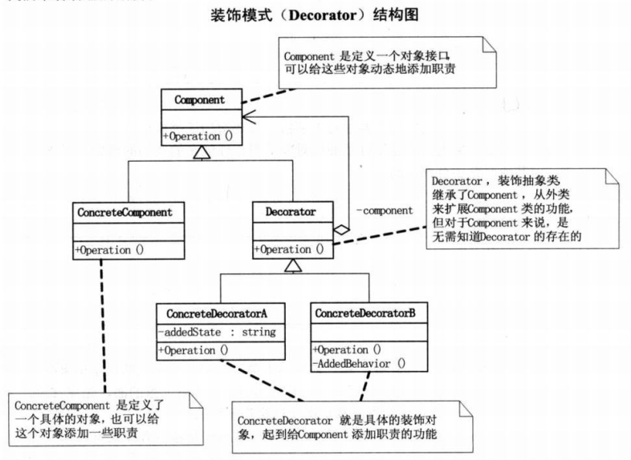

# Decorator

## 定义

装饰模式，动态地给一个对象添加一些额外的职责，就增加功能来说，装饰模式比生成子类更加灵活。
是一种结构型设计模式。

## 结构图

## 优点
+ 把类中的装饰功能从类中搬移出去，简化原有的类；
+ 有效地把类的核心职能和装饰职能分开，而且可以去除相关类中重复的装饰逻辑。

## 应用

RxJava 中的操作符，线程切换用到了装饰器模式；
Java IO 中用到了装饰器模式；
Android 中的 Context 体系用到了装饰器模式。
## 参考

https://blog.csdn.net/gdutxiaoxu/article/details/51885105

https://www.cnblogs.com/jzb-blog/p/6717349.html