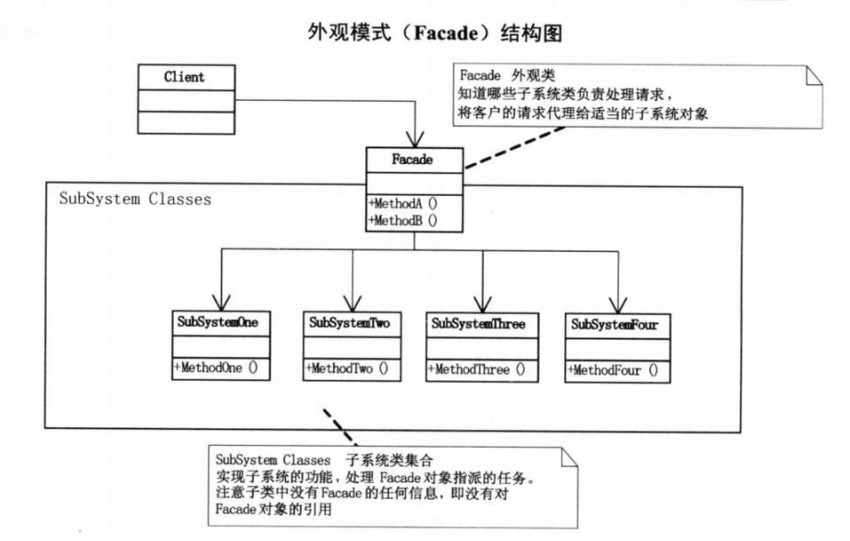

# 定义

外观模式(Facade)，又叫门面模式，为子系统中的一组接口提供一个一致的界面，此模式
定义了一个高层接口，这个接口使得这一子系统更加容易使用。

外观模式是一种结构型模式。

# 结构图

# 优缺点
外观模式是迪米特法则的典型应用。
- 优点
降低了子系统与客户端直接的耦合度，使得子系统的变化不会影响调用它的客户类；
对客户屏蔽了子系统组件，减少了客户处理的对象数目，并使得子系统使用起来更加容易；
降低了大型软件系统中的编译依赖性，简化了系统在不同平台之间的移植过程，因为编译一个子系统不会影响其他的子系统，也不会影响外观对象。

- 缺点
不能很好地限制客户使用子系统类；
增加新的子系统可能需要修改外观类或客户端的源代码，违背了“开闭原则”。
