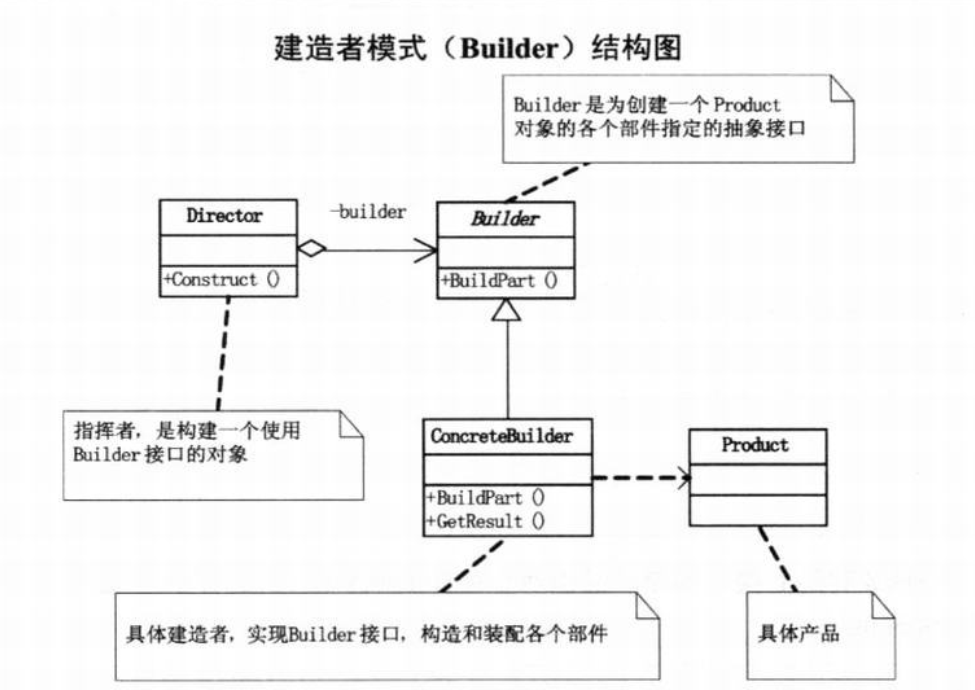

# 定义

建造者模式（Builder），又叫生成器模式，将一个复杂对象的构建与它的表示分离，使得同样的构建过程可以创建不同的表示。

建造者模式是创建型模式。

# 结构图

# 优缺点

优点如下：

- 各个具体的建造者相互独立，有利于系统的扩展。
- 客户端不必知道产品内部组成的细节，便于控制细节风险。

缺点如下：

- 产品的组成部分必须相同，这限制了其使用范围。
- 如果产品的内部变化复杂，该模式会增加很多的建造者类。

建造者（Builder）模式和工厂模式的关注点不同：建造者模式注重零部件的组装过程，而工厂方法模式更注重零部件的创建过程，但两者可以结合使用。

# 应用

Universal-Image-Loader 的初始化配置使用了建造者模式：当我们的类中有很多属性的时候，更重要的是有很多可选属性的时候，我们就可以使用builder设计模式。
AlertDialog 的创建使用了建造者模式。