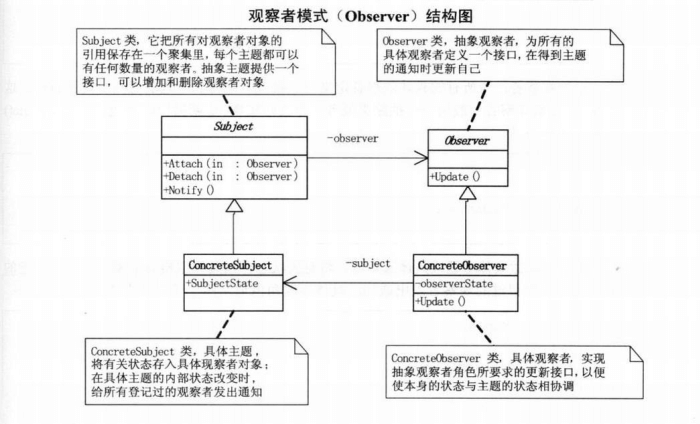

# 定义

观察者模式，又叫做发布-订阅（Publish/Subscribe）模式，定义了一种一对多的依赖关系，让多个观察者对象同时监听某
一个主题对象。这个主题对象在状态发生变化时，会通知所有观察者对象，使它们能够自动更新自己。

观察者模式是一种行为型模式。

# 结构图

# 理解

当一个对象的改变需要同时改变其他对象时，而且不知道具体有多少对象有待改变时，应该考虑使用观察者模式。实际开发中，
调用了 FileDownloader 的下载模块，FileDownloader 只提供了一个下载回调，而我需要在不同的页面监听到下载回调，比如
在下载中页面，下载完成页面，主页显示下载数目。这时候，就需要用到观察者模式。

当一个抽象模型有两个方面，其中一个方面依赖于另一个方面，这时用观察者模式可以将这两者封装在独立的对象中使它们各自
独立地改变和复用。从这点看，观察者模式其实是在接触耦合，让耦合的双方都依赖于抽象，而不是依赖于具体，从而使得各自
代码的改变都不会影响到另一边的变化。

# 优缺点

优点：

- 降低了目标与观察者之间的耦合关系，两者之间是抽象耦合关系。
- 目标与观察者之间建立了一套触发机制。

缺点：

- 目标与观察者之间的依赖关系并没有完全解除，而且有可能出现循环引用。
- 当观察者对象很多时，通知的发布会花费很多时间，影响程序的效率。

观察者模式如果不使用委托，就面临着观察者需要通过实现接口来统一update方法。这对于已经封装完成的功能来说，要求过于苛刻。
那么如果在观察者模式中使用委托，就可以摆脱掉实现接口统一方法的必要，从而完成真正意义上的类与类之间的解耦，满足开闭原则。

# 应用

Android 中大量采用了观察者模式，如点击监听，列表刷新，RxJava，EventBus，BroadcastReceiver。

