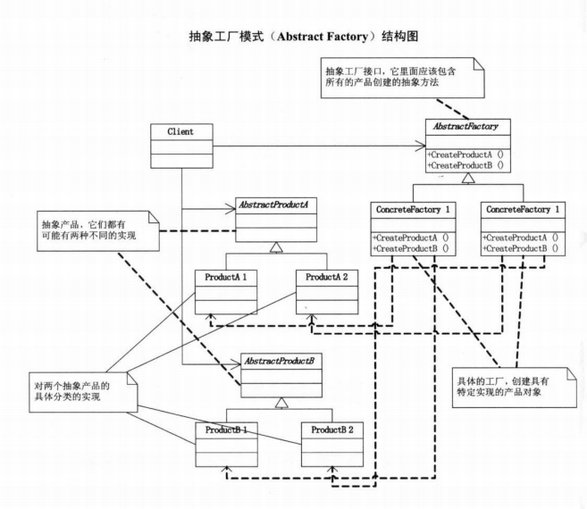

# 定义

抽象工厂模式(AbstractFactory), 是一种创建型模式, 提供了一个创建一系列相关或相互依赖对象的接口, 且访问类无须指定所要产品的具体类就能得到同族的不同等级的产品的模式结构.

# 结构图

# 理解

- 抽象工厂模式是工厂方法模式的升级版, 工厂方法模式只生产一个等级的产品，而抽象工厂模式可生产多个等级的产品;
- 优点: 易于交换产品系列;
- 缺点: 当产品族中需要增加一个新的产品时，所有的工厂类都需要进行修改, 违反了开闭原则.
当增加一个新的产品族时只需增加一个新的具体工厂，不需要修改原代码，满足开闭原则。
