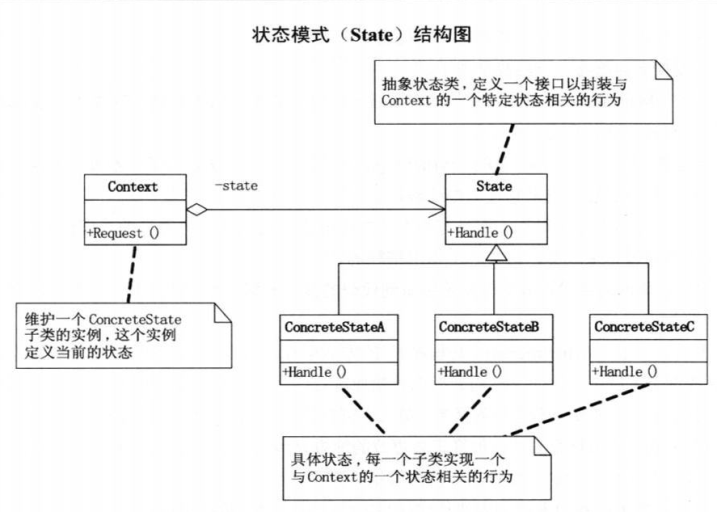

# 状态模式

## 定义

当一个对象的内在状态改变时允许改变其行为, 这个对象看起来像是改变了其类.

状态模式是一种行为型设计模式.

## 结构图

## 好处与用处

+ 好处

	+ 将与特定状态相关的行为局部化, 并且将不同状态的行为分割开来. 也就是说, 将特定的状态相关的行为都放入一个对象中, 由于所有与状态相关的代码都存在于某个ConcreteState中,所以通过定义新的子类可以很容易地增加新的状态和转换.
	+ 状态模式通过把各种状态转移逻辑分布到 State 的子类之间, 来减少相互的依赖.
+ 用处
	+ 消除庞大的条件分支语句.
	+ 当一个对象的行为取决于它的状态, 并且它必须在运行时刻根据状态改变它的行为时,就可以考虑使用状态模式了.
	
## 状态模式 vs 策略模式

在状态模式中, 特定状态知道其他状态的存在, 且能触发从一个状态到另一个状态的转换;
在策略模式中, 特定策略几乎完全不知道其他策略的存在.

参考：[责任链模式和状态模式对比（转）](https://www.cnblogs.com/xibei666/p/6858145.html)