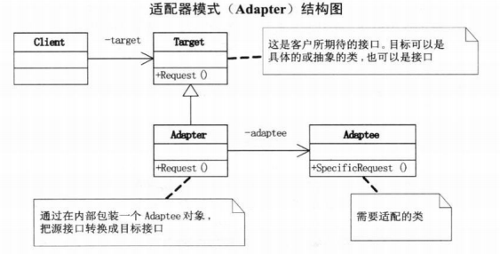

# 定义

适配器模式(Adapter), 又叫包装模式, 是一种结构型模式, 将一个类的接口转换成客户希望的另一个接口. Adapter 模式使得原本由于接口不兼容而不能在一起工作的那些类可以一起工作.

# 结构图
这里讲的是对象适配器模式:

# 理解
系统的数据和行为都正确, 但接口不符时, 应该考虑用适配器.
对适配器模式的三种类型: 类适配器模式,对象适配器模式和接口适配器模式.
对象适配器, 与被适配类是关联关系;
类适配器, 与被适配类是继承关系.
接口适配器, 又叫缺省适配器, 当不需要实现一个接口所提供的所有方法时，可先设计一个抽象类实现该接口，并为接口中每个方法提供一个默认实现（空方法），那么该抽象类的子类可以选择性地覆盖父类的某些方法来实现需求，它适用于不想使用一个接口中的所有方法的情况，又称为单接口适配器模式。

对象适配器 vs 类适配器:
对象适配器支持传入一个被适配类对象, 可以做到对多种被适配接口进行适配;
类适配器直接继承被适配类, 无法动态修改.

适配器模式 vs 代理模式:
适配器模式以达到适配最终接口为目的
代理模式以拦截、处理为目的

# 应用
Java 中的 Arrays.asList 体现的是适配器模式，只是转换接口，后台的数据仍是数组。
