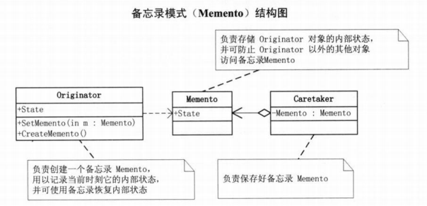

# 定义
备忘录模式（Memento），在不破坏封装性的前提下，捕获一个对象的内部状态，并在该对象之外保存这个状态。这样以后就可将该状态恢复到原先保存的状态。
备忘录模式是一种行为型模式。

# 结构图

# 优点
提供了一种可以恢复状态的机制。当用户需要时能够比较方便地将数据恢复到某个历史的状态。
实现了内部状态的封装。除了创建它的发起人之外，其他对象都不能够访问这些状态信息。
简化了发起人类。发起人不需要管理和保存其内部状态的各个备份，所有状态信息都保存在备忘录中，并由管理者进行管理，这符合单一职责原则。

# 缺点
资源消耗大。如果要保存的内部状态信息过多或者特别频繁，将会占用比较大的内存资源。

# 应用
棋类游戏的悔棋；Ctrl+Z 撤销；数据库的回滚。
Android 中的 Activity 的状态保存机制；Canvas 的 save 和 restore。