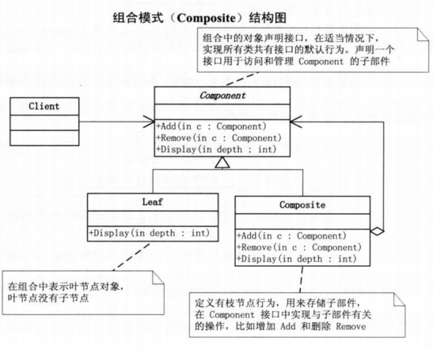

# 定义
组合模式（Composite），又叫部分-整体模式，将对象组合成树形结构以表示“部分-整体”的层次结构。组合模式使得用户对单个对象和组合对象的使用具有一致性。
组合模式是一种结构型模式。
# 结构图

# 分类

- 透明方式
在 Component 中声明所有用来管理子对象的方法，其中包括 Add，Remove 等。这样实现了 Component 接口的子类都具备了 Add，Remove 方法。这样做的好处在于叶节点和根节点对于外界没有区别，它们具有完全一致的行为接口。但问题也很明显，因为 Leaf 本身不具备 Add，Remove 方法的功能，所以 Leaf 实现这些方法是没有意义的。
- 安全方式
在 Component 接口中不去声明 Add，Remove 方法，子类 Leaf 自然不需要去实现这些方法，而是在 Composite 中声明管理子对象的方法。但是这样就不够透明，树叶和树枝类将不具有相同的接口，客户端的调用需要做相应的判断，有些不方便。

# 优点
组合模式使得客户端代码可以一致地处理单个对象和组合对象，无须关心自己处理的是单个对象，还是组合对象，这简化了客户端代码；
更容易在组合体内加入新的对象，客户端不会因为加入了新的对象而更改源代码，满足“开闭原则”。

# 缺点
设计较复杂，客户端需要花更多时间理清类之间的层次关系；
不容易限制容器中的构件；
不容易用继承的方法来增加构件的新功能。

# 应用
公司的总公司，分公司，办事处；
文件系统的文件与文件夹。
Android 中的 View 与 ViewGroup 就是组合模式的应用，属于安全方式。
