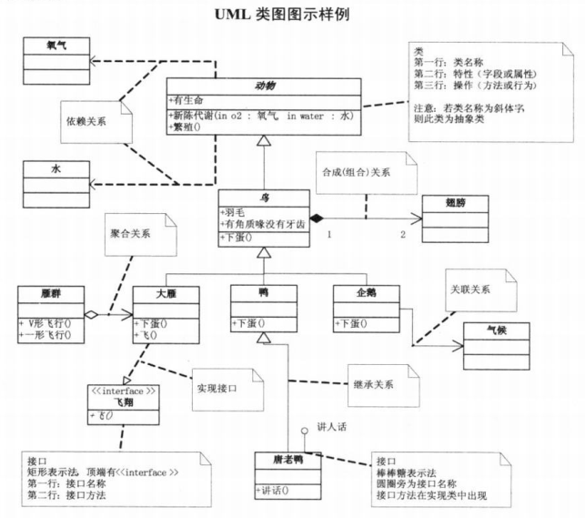

# 简单工厂模式

## 面向对象编程的好处

通过封装,继承,多态把程序的耦合性降低;

通过使用设计模式使得程序更加的灵活,容易修改,并且易于复用.

可维护指的是可以修改;

可复用指的是可以重复使用;

可扩展指的是可以增加;

灵活性好指的是面对需求,调整方便.

## UML 类图

类与类之间的继承关系,用空心三角形 + 实线表示;

类与接口之间的实现关系,用空心三角形 + 虚线表示;

当一个类"知道"另一个类时, 可以用关联(association), 用实现箭头来表示;

聚合(aggregation)表示一种弱的"拥有"关系,体现的是A对象可以包含B对象,但B对象不是A对象的一部分,聚合关系用空心的菱形+实线箭头来表示;

合成(composition)或者说组合是一种强的"拥有"关系,体现了严格的部分和整体的关系,部分和整体的生命周期是一样的,用实心的菱形+实线箭头来表示;

依赖关系,用虚线箭头表示.

## 定义

简单工厂模式,又称为静态工厂模式,属于类创建型模式, 不属于 23 中 GOF 设计模式. 定义一个 Factory 类, 可以根据参数的不同返回不同的实例, 被创建的类通常有共同的父类.实质是由一个工厂类根据传入的参数,动态决定应该创建哪一个产品类实例.

之所以称为静态工厂模式, 是因为 Factory 类为静态类或者包含静态方法.

## 参与者

+ Product: 抽象产品类, 将具体产品类公共的代码进行抽象和提取后封装在一个抽象产品类中;
+ ConcreteProduct: 具体产品类, 将需要创建的各种不同产品对象的相关代码封装到具体产品类中;
+ Factory: 工厂类, 提供一个工厂类用于创建各种产品，在工厂类中提供一个创建产品的工厂方法，该方法可以根据所传入参数的不同创建不同的具体产品对象;
+ Client: 客户端类, 只需调用工厂类的工厂方法并传入相应的参数即可得到一个产品对象.

## 好处

实现了创建和使用相分离

Client 无需知道所创建的ConcreteProduct类名, 只需要知道 ConcreteProduct 所对应的参数.

## 缺点

Factory 类集中了所有 ConcreteProduct 的创建逻辑, 职责过重. 一旦需要添加新的 ConcreteProduct, 就需要修改 Factory 逻辑. 这样违背了开放封闭原则.

由于使用了 static 方法,造成 Factory 无法形成基于继承的结构.

## 适用

工厂类负责创建的对象比较少：由于创建的对象较少，不会造成工厂方法中的业务逻辑太过复杂。

客户端只知道传入工厂类的参数，对于如何创建对象不关心：客户端既不需要关心创建细节，甚至连类名都不需要记住，只需要知道类型所对应的参数。

