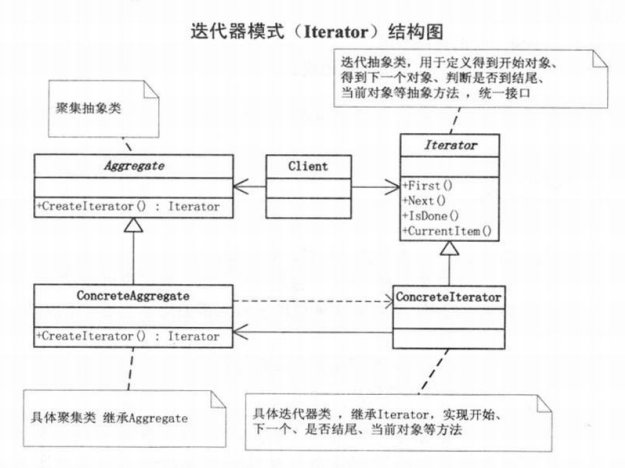

# 定义
迭代器模式（Iterator），是一种行为型模式，提供一种方法顺序访问一个聚合对象中的各个元素，而不是暴露该对象的内部显示。

# 结构图

# 优点
访问一个聚合对象的内容而无须暴露它的内部表示。
遍历任务交由迭代器完成，这简化了聚合类。
它支持以不同方式遍历一个聚合，甚至可以自定义迭代器的子类以支持新的遍历。
增加新的聚合类和迭代器类都很方便，无须修改原有代码。
封装性良好，为遍历不同的聚合结构提供一个统一的接口。

# 缺点
增加了类的个数，这在一定程度上增加了系统的复杂性。

# 应用
Java 中的集合类遍历采用了迭代器模式。
Android 中数据库查询的 Cursor。