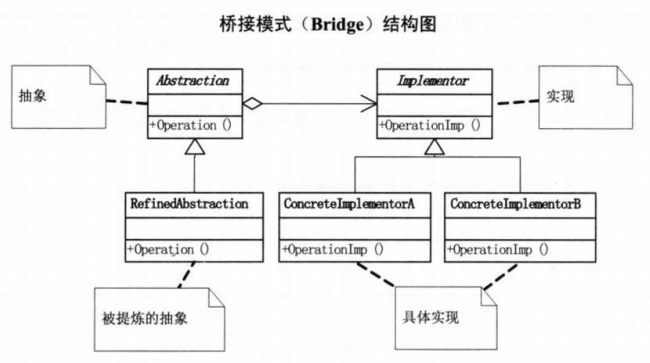

# 桥接模式

## 定义
桥接模式（Bridge），将抽象部分与它的实现部分分离，使它们都可以独立地变化。

桥接模式是一种结构型模式。

## 结构图

## 理解
如果软件系统中某个类存在多个独立变化的维度，通过该模式可以将这多个维度分离出来，使它们可以独立扩展，让系统更加符合“单一职责原则”。与多层继承方案不同，它将多个独立变化的维度设计为多个独立的继承等级结构，并且在抽象层建立一个抽象关联，该关联关系类似一条连接多个独立继承结构的桥，故名桥接模式。桥接模式用一种巧妙的方式处理多层继承存在的问题，用抽象关联取代了传统的多层继承，将类之间的静态继承关系转换为动态的对象组合关系，使得系统更加灵活，并易于扩展，同时有效控制了系统中类的个数。

在使用桥接模式时，首先应该识别出一个类所具有的多个独立变化的维度，将它们设计为多个独立的继承等级结构，为多个维度都提供抽象层，并建立抽象耦合。通常情况下，我们将具有多个独立变化维度的类的一些普通业务方法和与之关系最密切的维度设计为“抽象类”层次结构（抽象部分），而将另一个维度设计为“实现类”层次结构（实现部分）。

桥接模式中体现了“单一职责原则”、“开闭原则”、“合成复用原则”、“里氏代换原则”、“依赖倒转原则”等。