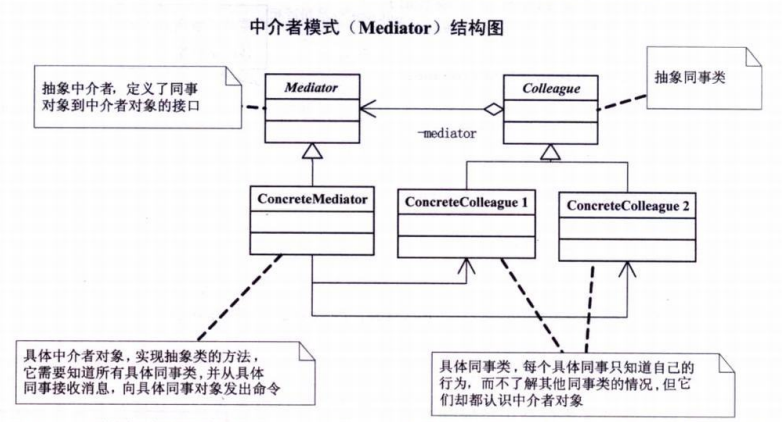

# 中介者模式

## 定义
中介者模式（Mediator），用一个中介对象来封装一系列的对象交互。中介者使各对象不需要显式地相互引用，从而使其耦合松散，而且可以独立地改变它们之间的交互。

中介者模式，又叫调停模式，是迪米特法则的典型应用。

中介者模式是一种对象行为型模式。
## 结构图

## 优点
- 降低了对象之间的耦合性，使得对象易于独立地被复用。
- 将对象间的一对多关联转变为一对一的关联，提高系统的灵活性，使得系统易于维护和扩展。

## 缺点
当同事类太多时，中介者的职责将很大，它会变得复杂而庞大，以至于系统难以维护。

## 模式的扩展
- 在实际开发中，通常采用以下两种方法来简化中介者模式，使开发变得更简单。
不定义中介者接口，把具体中介者对象实现成为单例。
- 同事对象不持有中介者，而是在需要的时f矣直接获取中介者对象并调用。
