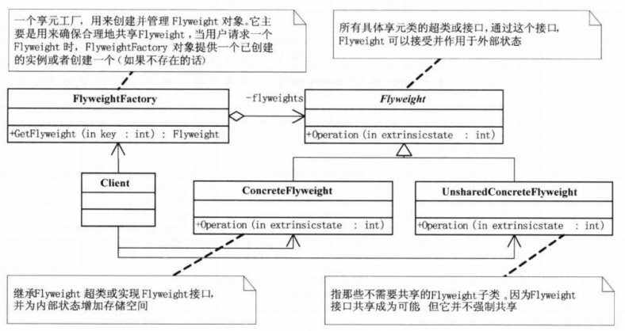

# 享元模式

## 定义
享元模式（Flyweight），运用共享技术来有效地支持大量细粒度对象的复用。它通过共享已经存在的对象来大幅度减少需要创建的对象数量、避免大量相似类的开销，从而提高系统资源的利用率。

## 结构图

## 理解
- 内部状态：在享元对象内部，不会随环境改变而改变的共享部分，称为享元对象的内部状态；
- 外部状态：在享元对象内部，随环境改变而改变的、不可以共享的状态，称为享元对象的外部状态。

享元模式的实现要领就是区分应用中的这两种状态，并将外部状态外部化。
## 优点
相同对象只要保存一份，这降低了系统中对象的数量，从而降低了系统中细粒度对象给内存带来的压力。
## 缺点
- 为了使对象可以共享，需要将一些不能共享的状态外部化，这将增加程序的复杂性。
- 读取享元模式的外部状态会使得运行时间稍微变长。
## 分类
- 单纯享元模式：这种享元模式中的所有的具体享元类都是可以共享的，不存在非共享的具体享元类。
- 复合享元模式：这种享元模式中的有些享元对象是由一些单纯享元对象组合而成的，它们就是复合享元对象。虽然复合享元对象本身不能共享，但它们可以分解成单纯享元对象再被共享。