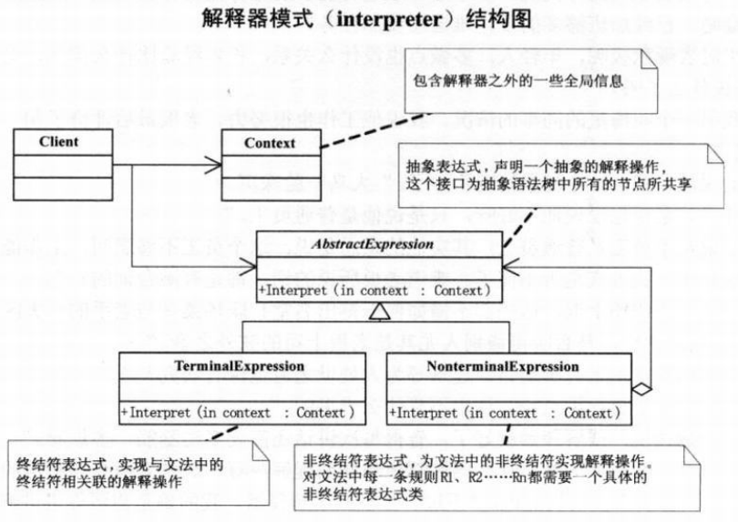

# 解释器模式

## 定义
解释器模式（interpreter），给分析对象定义一个语言，并定义该语言的文法表示，再设计一个解析器来解释语言中的句子。也就是说，用编译语言的方式来分析应用中的实例。

解释器模式是类行为型模式。
## 结构图

## 优点
- 扩展性好。由于在解释器模式中使用类来表示语言的文法规则，因此可以通过继承等机制来改变或扩展文法。
- 容易实现。在语法树中的每个表达式节点类都是相似的，所以实现其文法较为容易。

## 缺点
- 执行效率较低。解释器模式中通常使用大量的循环和递归调用，当要解释的句子较复杂时，其运行速度很慢，且代码的调试过程也比较麻烦。
- 会引起类膨胀。解释器模式中的每条规则至少需要定义一个类，当包含的文法规则很多时，类的个数将急剧增加，导致系统难以管理与维护。
- 可应用的场景比较少。在软件开发中，需要定义语言文法的应用实例非常少，所以这种模式很少被使用到。

## 应用
- Android的清单文件，是由PackageManagerService使用了PackageParser这个类来解释的，这里面就用到了解释器模式；
- Java 中的 jep 类库。