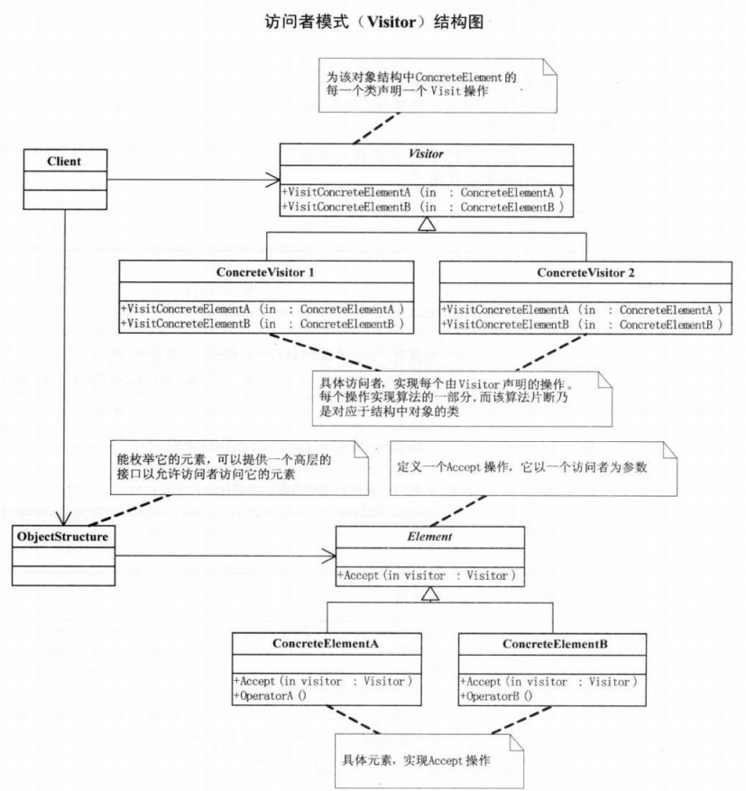

# 访问者模式

## 定义
访问者模式（visitor），将作用于某种数据结构中的各元素的操作分离出来封装成独立的类，使其在不改变数据结构的前提下可以添加作用于这些元素的新的操作，为数据结构中的每个元素提供多种访问方式。它将对数据的操作与数据结构进行分离，是行为类模式中最复杂的一种模式。

访问者模式是一种对象行为型模式。

## 结构图

## 优点
- 扩展性好。能够在不修改对象结构中的元素的情况下，为对象结构中的元素添加新的功能。
- 复用性好。可以通过访问者来定义整个对象结构通用的功能，从而提高系统的复用程度。
- 灵活性好。访问者模式将数据结构与作用于结构上的操作解耦，使得操作集合可相对自由地演化而不影响系统的数据结构。
- 符合单一职责原则。访问者模式把相关的行为封装在一起，构成一个访问者，使每一个访问者的功能都比较单一。

## 缺点
- 增加新的元素类很困难。在访问者模式中，每增加一个新的元素类，都要在每一个具体访问者类中增加相应的具体操作，这违背了“开闭原则”。
- 破坏封装。访问者模式中具体元素对访问者公布细节，这破坏了对象的封装性。
- 违反了依赖倒置原则。访问者模式依赖了具体类，而没有依赖抽象类。

## 访问者模式的使用场景
- 对象结构比较稳定，但经常需要在此对象结构上定义新的操作。
- 需要对一个对象结构中的对象进行很多不同的并且不相关的操作，而需要避免这些操作“污染”这些对象的类，也不希望在增加新操作时修改这些类。

