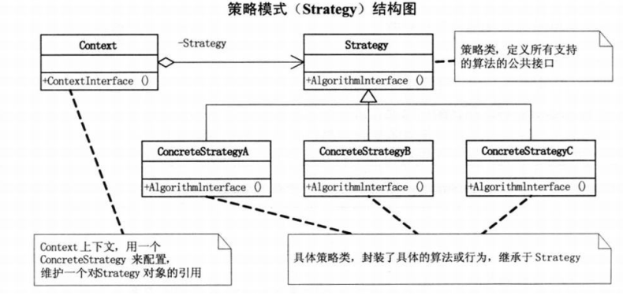

# 策略模式

## 定义

**它定义了算法家族, 分别封装起来, 让它们之间可以互相替换, 此模式让算法的变化, 不会影响到使用算法的客户.**

**策略模式是一种定义一系列算法的方法, 从概念上讲, 所有这些算法完成的都是相同的工作, 只是实现不同, 它可以以相同的方式调用所有的算法, 减少了各种算法类与使用算法类之间的耦合.**

## 参与者

+ Strategy 类, 定义所有支持的算法的公共接口;
+ ConcreteStrategy 类, 具体策略类, 封装了具体的算法或行为, 继承于 Strategy;
+ Context 类, 用一个 ConcreteStrategy 来配置, 维护一个对 Strategy 对象的引用.
## 好处

+ 策略模式的 Strategy 类层次为 Context 定义了一系列可供重用的算法或行为. 继承有助于析取出这些算法中的公共功能.
+ 简化了单元测试, 因为每个算法都有自己的类, 可以通过自己的接口单独测试.

## 适用

+ 策略模式是用来封装变化的,但在实践中,我们发现可以用它来封装几乎任何类型的规则,只要在分析过程中听到需要在不同时间应用不同的业务规则,就可以考虑使用策略模式处理这种变化的可能性.
+ 在基本的策略模式中, 选择所用具体实现的职责由客户端对象来承担,并转给策略模式的 Context 对象. 这本身并没有解除客户端需要判断的压力,而策略模式与简单工厂模式结合后, 选择具体实现的职责也可以由 Context 来承担, 这就最大化地减轻了客户端的职责.