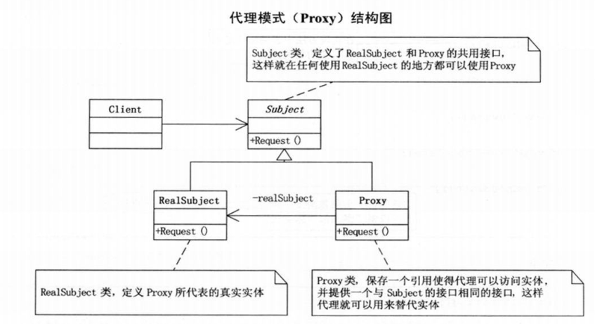

# Proxy

## 定义

为其他对象提供一种代理以控制对这个对象的访问。
是一种结构型模式。
分为静态代理和动态代理。

## 结构图

通过定义一个继承抽象主题的代理来包含真实主题，从而实现对真实主题的访问。
1.抽象主题（Subject）类：通过接口或抽象类声明真实主题和代理对象实现的业务方法。
2.真实主题（Real Subject）类：实现了抽象主题中的具体业务，是代理对象所代表的真实对象，是最终要引用的对象。
3.代理（Proxy）类：提供了与真实主题相同的接口，其内部含有对真实主题的引用，它可以访问、控制或扩展真实主题的功能。

## 优缺点
+ 优点：
    代理模式在客户端与目标对象之间起到一个中介作用和保护目标对象的作用；
    代理对象可以扩展目标对象的功能；
    代理模式能将客户端与目标对象分离，在一定程度上降低了系统的耦合度。
+ 缺点：
    在客户端和目标对象之间增加一个代理对象，会造成请求处理速度变慢；
    增加了系统的复杂度。
+ 静态代理的不足：
    真实主题与代理主题一一对应，增加真实主题也要增加代理；
    设计代理以前真实主题必须事先存在，不太灵活。
    动态代理可以解决以上的不足。
## 应用