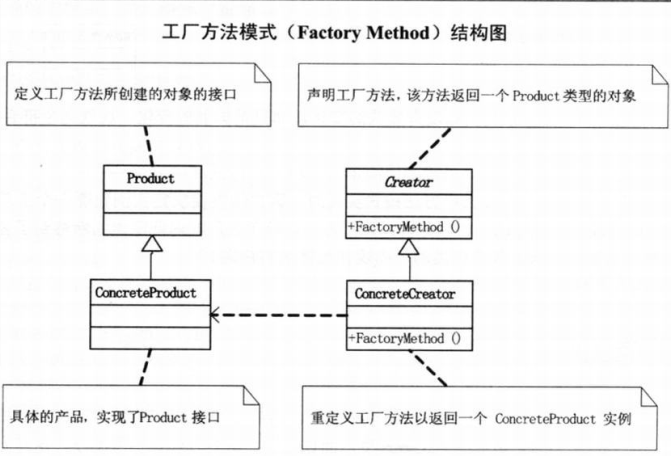

# 工厂模式

## 定义

工厂方法模式（Factory Method），定义一个用于创建对象的接口，让子类决定实例化哪一个类。工厂方法使一个类的实例化延迟到其子类。

## 结构图

## 简单工厂模式 vs 工厂模式

简单工厂模式的最大优点在于工厂类中包含了必要的逻辑判断，根据客户端的选择条件动态实例化相关的类，对于客户端来说，去除了与具体产品的依赖。但是，当要增加功能时，却不得不修改工厂类，违背了开放-封闭原则。
工厂模式依据依赖倒转原则，把工厂类抽象出一个接口，用于创建抽象产品，这样当新功能增加时，只要增加代码即可，无需修改原有的工厂类。
工厂模式实现时，客户端需要决定实例化哪一个工厂类来实现运算类，选择判断的问题还是存在的，也即是说，工厂方法把简单工厂的内部逻辑判断移到了客户端代码来进行。

